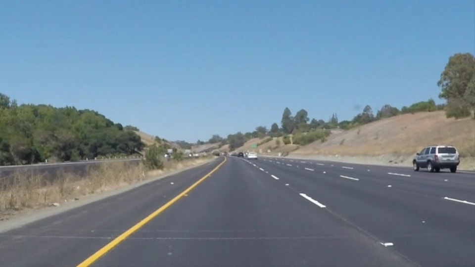
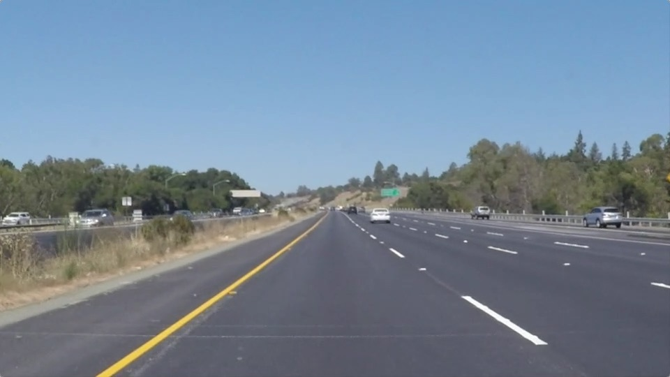
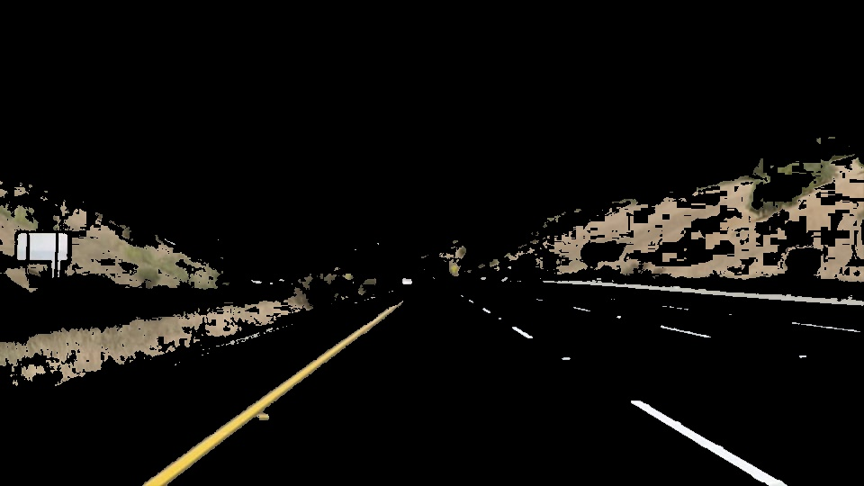

# Finding Lane Lines on the Road
***
In this project, I use Ipython and OpenCV to identify lane lines on the road and use some methods on a series of individual image, finally I apply on the video clips. the following several steps:

- Pre-processing
- Color Selection
- Edge Detection
- Lane Lines Extrapolate

The Project
---

If you have already installed the [CarND Term1 Starter Kit](https://github.com/udacity/CarND-Term1-Starter-Kit/blob/master/README.md) you should be good to go!   If not, you should install the starter kit to get started on this project. 

## Pre-processing
### Import packages
Import pyplot and image from matplotlib, numpy and cv2 for operating on the image. 

### Read the testing images
**Here are the testing images**
<figure class="center">
	
	
</figure>
<figure class="center">
	
	
</figure>
<figure class="center">
	
	
</figure>

## Color Selection
***
### color selection
Use Color Selection to solve lane lines problem which is yellow or white color. [ZhiHu-How to detect lanes on the road](https://www.zhihu.com/question/54854524) gives good examples to solve color selection problem, especially complex conditions. use `cv2.cvtColor(img, cv2.COLOR_RGB2HSV)` convert RGB image to [HSV(Hue, Saturation, Value)](https://en.wikipedia.org/wiki/HSL_and_HSV). Hue is one of the main properties (called color appearance parameters) of a color. Following those instructions, I set the yellow low thresholds `thresholds_Y_low = [20, 80, 80]` and high thresholds `thresholds_Y_high = [30, 255, 255]`, white low thresholds `thresholds_W_low = [0, 0, 180]` and high thresholds `thresholds_W_high = [180, 25, 255]`, use `cv2.cvtColor(img, cv2.COLOR_HSV2RGB)` and print images are well for lane lins.

<figure class="half">
	
	
</figure>
<figure class="center">
	
	
</figure>
<figure class="center">
	
	
</figure>

***
### convert to grayscal images
Covert image to grayscale `cv2.cvtColor(img, cv2.COLOR_RGB2GRAY)` before [Canny](https://docs.opencv.org/2.4/modules/imgproc/doc/feature_detection.html?highlight=cv2.canny#cv2.Canny) edge because of an image is single-channel 8-bit input image.
<figure class="half">
	
	
</figure>
<figure class="center">
	
	
</figure>
<figure class="center">
	
	
</figure>

## Edge Detection
### Blur images - Gaussian Blur
In image processing, a [Gaussian Blur](https://en.wikipedia.org/wiki/Gaussian_blur) (also Gaussian smoothing) is the result of blurring an image by `cv2.GaussianBlur` function to reduce image noise and reduce detail. the `kernel_size` for Gaussian smoothing to be an odd number, I set `kernel_size = 7`.

<figure class="half">
	
	
</figure>
<figure class="center">
	
	
</figure>
<figure class="center">
	
	
</figure>

### Canny Edge Detection
The [Canny Edge Detector](https://en.wikipedia.org/wiki/Canny_edge_detector) is an edge detection operator that uses a multi-stage algorithm to detect a wide range of edges in images, This operator can extract useful lane lines information. [`cv2.Canny`](https://docs.opencv.org/2.4/modules/imgproc/doc/feature_detection.html?highlight=cv2.canny#cv2.Canny), `high_threshold` can detect the strong edged or strong gradient pixel, and `low_threshold` can reject pixel below the value.Set `low_threshold = 50`, `high_threshold = 150` as usual.

<figure class="center">
	
	
</figure>
<figure class="center">
	
	
</figure>
<figure class="center">
	
	
</figure>

### Region of Interest Mask
ROI sample the images and identify the particular area where is to extract lane line information and discard the useless region information.
<figure class="center">
	
	
</figure>
<figure class="center">
	
	
</figure>
<figure class="center">
	
	
</figure>

### Hough Transform
[Hough transform](https://en.wikipedia.org/wiki/Hough_transform) `cv2.HoughLinesP` concerns with the identification of lines in the image. `cv2.HoughLinesP` has several parameters need to know.

- rho – Distance resolution of the accumulator in pixels.
- theta – Angle resolution of the accumulator in radians.
- threshold – Accumulator threshold parameter. Only those lines are returned that get enough votes.
- minLineLength – Minimum line length. Line segments shorter than that are rejected.
- maxLineGap – Maximum allowed gap between points on the same line to link them.

### Draw lines
Print lane line edge before we get lines from `hough_lines` function.

<figure class="center">
	
	
</figure>
<figure class="center">
	
	
</figure>
<figure class="center">
	
	
</figure>

## Lane Lines Extrapolate
Through the Lines of data, we can infer whether the collected lines are left or right, if slope `k > 0` the line is left and `k < 0` is right, and also use `abs(k) > 0.5` for some noise removal. and store in the `l_lines` and `r_lines`, we can extroplate left and right lane line's value`(y = kx +b)` from the average of left slope, left intercept, right slope and right intercept.

I use two methods to infer the average value. One is to mean function and the other is the average of weight. Find the length of a straight line, the greater of the lenght, the greater of the weight. The average of weight will reduce some unnecessary noise. Of course, I think the average weight would be better, maybe not jitter, but it didn't show the advantage in the testing videos, maybe the parameters are not tune well or has a better solution.

### Draw lines by mean
The following images are the result of using `average_mean()` function.
<figure class="center">
	
	
</figure>
<figure class="center">
	
	
</figure>
<figure class="center">
	
	
</figure>

The following videos are the result of using `average_mean()` function.

**SolidWhiteRight_mean.mp4**
<figure class="center">
<video id="video" width="640" controls="" preload="none" poster="test_images_output/solidWhiteRight.jpg">
	<source id="mp4" src="test_videos_output/solidWhiteRight_mean.mp4"
	type="video/mp4" width="640" height="400">
</video>
</figure>

**solidYellowLeft_mean.mp4**
<figure class="center">
<video id="video" width="640" controls="" preload="none" poster="test_images_output/solidYellowLeft.jpg">
	<source id="mp4" src="test_videos_output/solidYellowLeft_mean.mp4"
	type="video/mp4" width="640" height="400">
</video>
</figure>

**challenge_mean.mp4**
<figure class="center">
<video id="video" width="640" controls="" preload="none" poster="test_images_output/solidYellowLeft.jpg">
	<source id="mp4" src="test_videos_output/challenge_mean.mp4"
	type="video/mp4" width="640" height="400">
</video>
</figure>

### Draw lines by average weight
**SolidWhiteRight_weight.mp4**
<figure class="center">
<video id="video" width="640" controls="" preload="none" poster="test_images_output/solidWhiteRight.jpg">
	<source id="mp4" src="test_videos_output/SolidWhiteRight_weight.mp4"
	type="video/mp4" width="640" height="400">
</video>
</figure>

**solidYellowLeft_weight.mp4**
<figure class="center">
<video id="video" width="640" controls="" preload="none" poster="test_images_output/solidYellowLeft.jpg">
	<source id="mp4" src="test_videos_output/solidYellowLeft_weight.mp4"
	type="video/mp4" width="640" height="400">
</video>
</figure>

**challenge_weight.mp4**
<figure class="center">
<video id="video" width="640" controls="" preload="none" poster="test_images_output/solidYellowLeft.jpg">
	<source id="mp4" src="test_videos_output/challenge_weight.mp4"
	type="video/mp4" width="640" height="400">
</video>
</figure>

Here are my pipline for detecting lane lines on the road.
## Identify potential shortcomings with your current pipeline
This method is suitable for detecting straight lane lines in well condition. I add a miss line detection method, I found it not good for detecting lane lines at the corners and shadows. 
Of course, in special weather and the environment can not play a good roler. Maybe I need to continue tune parameters such as the threshold of the HSV or something else to make it more accurate. Maybe we can use other techniques such as laser detecter or rader in a special environment. 

